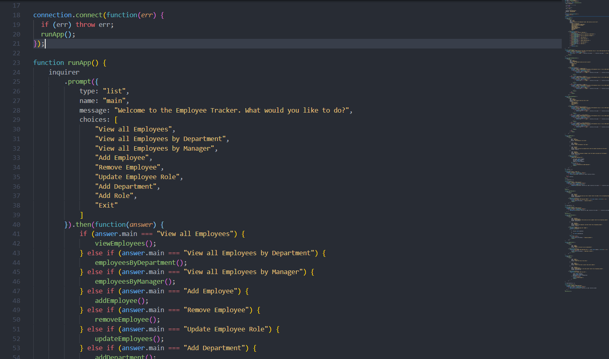

  

# Employee Tracker
a solution for managing a company's employees using node, inquirer, and MySQL.


     
Video: https://www.youtube.com/watch?v=aPIwQ1CNN3E&t

### Requirements for VS Code
* Node
* MySQL
* Inquirer


### User Story
```
As a business owner
I want to be able to view and manage the departments, roles, and employees in my company
So that I can organize and plan my business
```
